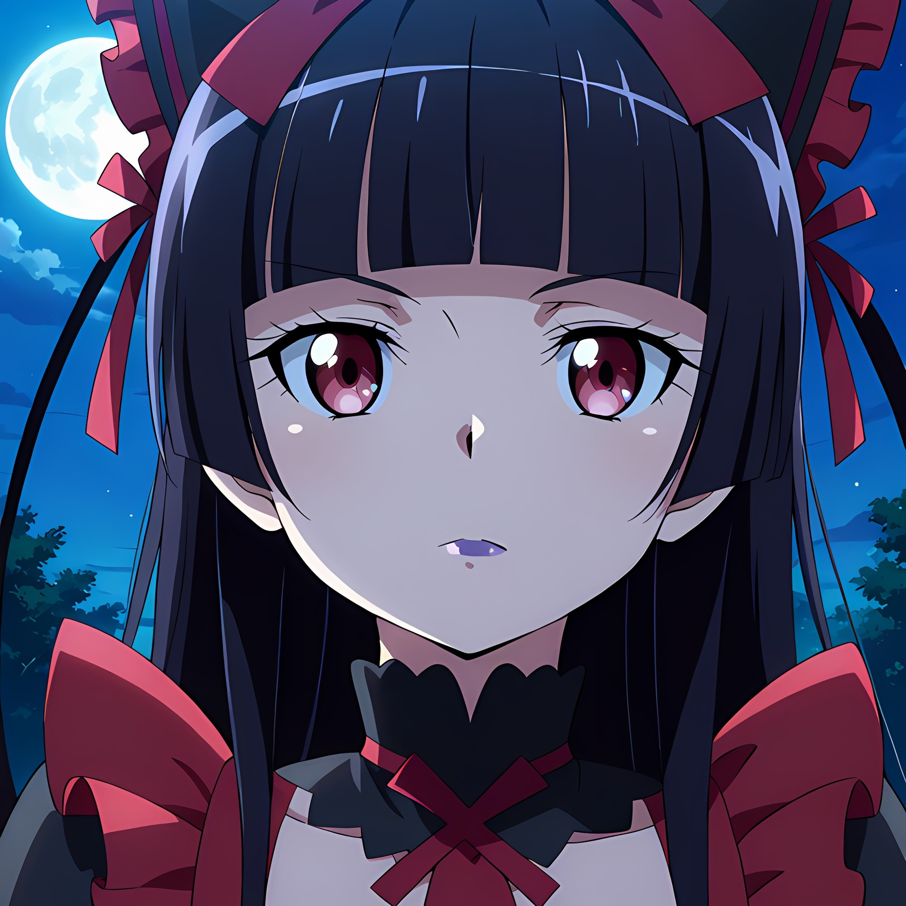

<h1 align="center">🖤 Rory Mercury Bot</h1>
<p align="center"><i>Versión mejorada y personalizada de Shiroko-Bot con temática gótica de Rory Mercury</i></p>

<p align="center">
  
</p>

<p align="center">
  
  
  
  
</p>

---

### `❕ Información 🖤`

**Rory-Mercury-Bot** es un bot de WhatsApp basado en **Node.js** con la librería **@whiskeysockets/Baileys**.
Más de 90 comandos organizados en 12 categorías con temática gótica.

🚫 Este proyecto **NO** está afiliado a WhatsApp ni WhatsApp LLC.

---

### 🛡️ Créditos

| Rol | Encargado | Enlace |
|---|---|---|
| **Creadora Original** | Arlette Xz | [Shiroko-Bot](https://github.com/Arlette-Xz/Shiroko-Bot/) |
| **Modding & Edición** | Pérez / Chuy | [Chuy-RoDev](https://github.com/Chuy-RoDev) |

---

<details>
<summary><b>🖤 FUNCIONES</b></summary>

```
╭─────────────────────────────────────────
│  🖤  RORY MERCURY BOT — MÓDULOS
├─────────────────────────────────────────
│
│  🗂️  INFO & UTILIDADES
│  ✦ Menú, ping, estado del sistema, créditos
│  ✦ Sugerencias y reportes de errores
│  ✦ ChatGPT / IA integrada
│  ✦ Stickers (imagen / video / gif / URL)
│  ✦ Traductor, calculadora, letra de canciones
│  ✦ FakeWapp, fetch, speedtest, tomp3
│  ✦ Subir archivos a URL (catbox)
│  ✦ Ver imágenes viewonce
│
│  🎮  DIVERSIÓN
│  ✦ Medidores: gay · emo · hetero · puta
│  ✦ Compatibilidad / ship entre usuarios
│  ✦ 8ball, impostor, top10 aleatorio
│  ✦ AFK / modo ausente, gambleo, npnp
│  ✦ Imágenes para parejas/amigos (ppccpp)
│
│  🎌  ANIME
│  ✦ +40 reacciones animadas en mp4
│     hug · kiss · slap · cry · dance · bite...
│
│  🔞  NSFW  ── requiere /nsfw enable
│  ✦ Rule34, Danbooru, Gelbooru
│  ✦ +18 reacciones con videos
│  ✦ Descarga de Xvideos y XNXX
│
│  📥  DESCARGAS
│  ✦ YouTube (audio y video)
│  ✦ Spotify, Apple Music
│  ✦ TikTok, Instagram, Twitter/X
│  ✦ Facebook, Pinterest
│  ✦ MediaFire, MEGA, ModAPK
│  ✦ Búsqueda y descarga de imágenes
│
│  🎴  GACHA
│  ✦ Roll, claim y harem de personajes
│  ✦ Tienda, venta e intercambio de waifus
│  ✦ Proteger, regalar y robar personajes
│  ✦ Votar y ver top global de personajes
│  ✦ Configuración de claim y serie
│
│  💰  ECONOMÍA RPG  (Soul-Coins 🖤)
│  ✦ Balance, banco, depósito y retiro
│  ✦ Casino, ruleta, coinflip, slots
│  ✦ Trabajar, crimen, minería, pesca, caza
│  ✦ Aventuras, mazmorras, curar salud
│  ✦ Robar monedas, dar monedas
│  ✦ Recompensas diaria, semanal y mensual
│  ✦ Ranking económico del grupo
│
│  👤  PERFIL
│  ✦ Ver y editar perfil personal
│  ✦ Niveles, experiencia y leaderboard
│  ✦ Top 10 del grupo
│  ✦ Matrimonio y adopción
│  ✦ Foto de perfil, descripción, género
│  ✦ Fecha de cumpleaños, waifu favorita
│
│  👥  GRUPOS  ── solo administradores
│  ✦ Hidetag / tagall — mención masiva
│  ✦ Usuarios activos del grupo
│  ✦ Kick, add, mute, warn, ban
│  ✦ Promote, demote, kicknum por país
│  ✦ Antilink, modo admin, antiraid
│  ✦ Abrir / cerrar grupo
│  ✦ Bienvenida y despedida personalizadas
│  ✦ Info del grupo, cambiar nombre/foto/desc
│  ✦ Restablecer enlace de invitación
│
│  🤖  BOTS & SOCKETS
│  ✦ Sub-bots con QR o código
│  ✦ Lista de bots, info de sockets
│  ✦ Cambiar banner, nombre, foto del bot
│  ✦ Cambiar moneda, bot primario y prefijo
│  ✦ Reset total de configuración por grupo
│
│  🔧  OWNER  ── solo creador
│  ✦ Ban/unban, exec, restart, update
│  ✦ Backup, savefiles, onlycc
│  ✦ Dar waifus, editar personajes del sistema
│  ✦ Autoadmin, gestión de grupos
│
╰─────────────────────────────────────────
```

</details>

---

### 📥 Necesitas instalar una de estas herramientas

<p align="center">
  <a href="https://f-droid.org/es/packages/com.termux/"></a>
  <a href="https://shell.cloud.google.com/"></a>
</p>

---

### 📱 Instala desde Termux

<details>
<summary><b>✰ Instalación Manual</b></summary>

**Paso 1 — Permisos y dependencias**
```bash
termux-setup-storage
```
```bash
apt update && apt upgrade -y && pkg install -y git nodejs ffmpeg imagemagick yarn build-essential python
```

**Paso 2 — Clonar el repositorio**
```bash
git clone https://github.com/Chuy-RoDev/Rory-Mercury-Bot && cd Rory-Mercury-Bot
```

**Paso 3 — Limpiar módulos incompatibles**
```bash
rm -rf node_modules
```
> Este paso es obligatorio. Los módulos incluidos en el repo están compilados para x86 (Cloud Shell) y no funcionan en ARM (Termux). Borrarlos aquí permite que npm los recompile correctamente para tu dispositivo.

**Paso 4 — Aprobar scripts de instalación nativos**
```bash
npm approve-scripts @whiskeysockets/baileys && npm approve-scripts sharp && npm approve-scripts protobufjs && npm approve-scripts imagemaker.js
```

**Paso 5 — Instalar dependencias**
```bash
npm install
```

**Paso 6 — Iniciar el bot**
```bash
npm start
```
> Si aparece `(Y/I/N/O/D/Z) [default=N]` usa `"y"` y luego `ENTER`.

---

**⏱️ Mantener activo con PM2**
```bash
termux-wake-lock && npm i -g pm2 && pm2 start index.js -- --session TuNombre && pm2 save && pm2 logs
```
> Reemplaza `TuNombre` por el nombre de tu sesión. Ejemplo: `Principal`, `Rory`, `Chuy`.

---

**♻️ Si el bot se detiene y quieres reiniciarlo**
```bash
cd Rory-Mercury-Bot && npm start
```

**🔑 Si necesitas un nuevo código QR o de vinculación**
```bash
cd Rory-Mercury-Bot && rm -rf Sessions/Principal && npm start
```

</details>

---

### ☁️ Instala desde Cloud Shell

<details>
<summary><b>✰ Instalación en Google Cloud Shell</b></summary>

```bash
git clone https://github.com/Chuy-RoDev/Rory-Mercury-Bot && cd Rory-Mercury-Bot
```
```bash
npm install
```
```bash
node index.js -- --session TuNombre
```
> Reemplaza `TuNombre` por el nombre de tu sesión. Ejemplo: `Tonaituh`, `Miku`, `Rory`.

**⏱️ Mantener activo con PM2**
```bash
npm i -g pm2 && pm2 start index.js -- --session TuNombre && pm2 save && pm2 logs
```
> Cloud Shell cierra sesión por inactividad. Con PM2 se mantiene mientras la pestaña esté abierta.

</details>

---

### ⚙️ Configuración

Edita `src/config.js`:

| Variable | Descripción | Ejemplo |
|---|---|---|
| `global.owner` | Tu número con código de país | `["58XXXXXXXXXX"]` |
| `global.botname` | Nombre del bot | `"Rory Mercury"` |
| `global.prefix` | Prefijo de comandos | `[":", "/", "🖤"]` |
| `global.currency` | Moneda del sistema RPG | `"Soul-Coins 🖤"` |
| `global.modes.nsfw` | NSFW activado por defecto | `false` |
| `global.modes.gacha` | Gacha activado por defecto | `true` |
| `global.modes.economy` | Economía activada por defecto | `true` |
| `global.modes.welcome` | Bienvenida activada por defecto | `false` |
| `global.modes.antilink` | Antilink activado por defecto | `false` |

---

### 📌 Notas importantes

- El bot funciona **solo en grupos** por defecto
- El owner puede operar desde privado con: `restart`, `update`, `join`, `reload`
- Cloud Shell cierra sesión por inactividad — la sesión queda guardada en `Sessions/`
- `ffmpeg` puede perderse entre sesiones — el bot lo reinstala automáticamente al arrancar
- La base de datos es compartida entre todas las sesiones (`src/database/database.json`)
- El NSFW está **desactivado por defecto** — actívalo por grupo con `/nsfw enable`
- El sistema de economía y gacha son **independientes por grupo**
- En Termux, los errores `Bad MAC` al inicio son normales si vienes de una sesión de Cloud Shell — desaparecen solos conforme los contactos interactúan con el bot

---

> 🖤 *Base original por Arlette Xz — Modificado y mantenido por Pérez / Chuy*